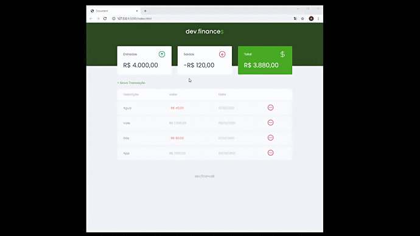
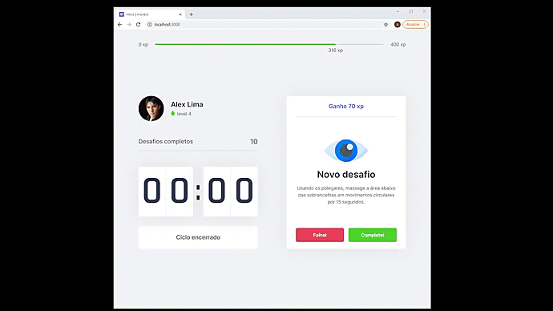
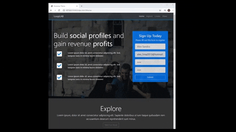
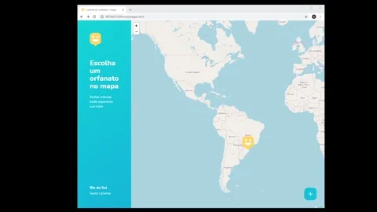
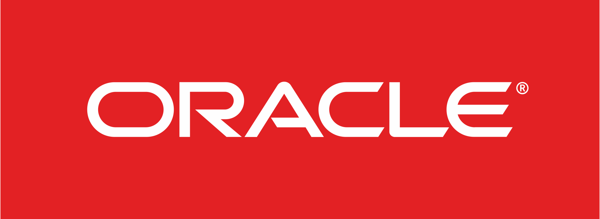
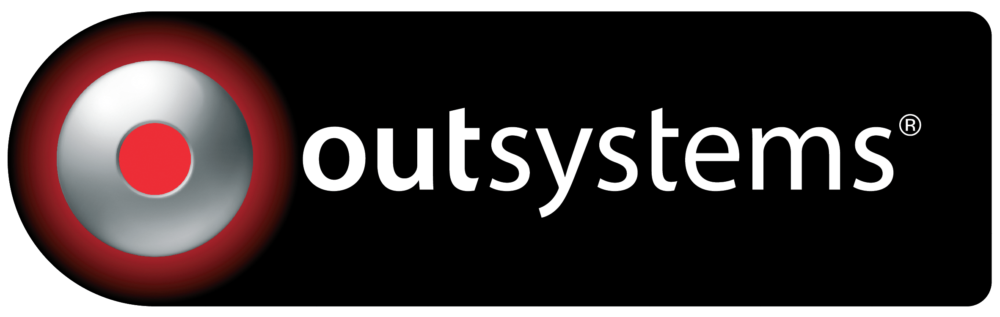

<!--------------Show Case Profile------------------>

   

<!--  -->

<!--------------My Biografi------------------------->

Hi there 👋. i'm Alex Lima, I live in the city of Hortolândia-sp, in the state of São Paulo, Brazil.
I am a PL Programmer developer and systems analyst working with almost 8 years of experience with technical and functional analysis, on business rules of the Elektric Energy market. I develop desktop solutions with Delphi and several databases, including Firebird, Oracle, MySql, among others.  I am currently focused on learning, Front-End, JavaScript and migrating to Web development, using the best technologies on the market.
Thank you for visiting my profile here on github and for wanting to know a little more about me, my works and projects.

## 🎓 Skills and Experience
- 🏢 Hi I’m currently working at [Indra](https://www.indracompany.com/pt-br/indra) developing on Delphi and Oracle eventually  on Mobile C# and in my free time i'm working on my Ecommerce Platform, using PHP and JavaScript.
- 📘 I’m currently learning **JavaScript**, **NextJs**, **NodeJs**, **TypeScript**, **ReactJs**, **Low-Code@OutSystems**, **Java**, **Chat-Bot** and **PHP** 
- ⚙️ Mastering: `.pas`,`.sql`,`.html`,`.css`
- 💻 I'm mostly active within the **HTML**, **CSS**, **PHP**, **JavaScript**, **NodeJs** and **Delphi** communities

<!-----My Contacts ------------------------------------------>
### 📧 Get in Touch
#
<!-- - GitHub: [https://github.com/alxlima][github]
- LinkedIn: [https://www.linkedin.com/in/alex-sandro-da-silva-lima-8b297839/][linkedin]
- Site: Under construction soon
- E-mail: alex_lima2013@hotmail.com
- Skype: [https://join.skype.com/invite/qVJuRbOrbqKG][skype]

[github]: https://github.com/alxlima
[linkedin]: https://www.linkedin.com/in/alex-sandro-da-silva-lima-8b297839/
[skype]: https://join.skype.com/invite/qVJuRbOrbqKG -->

 &nbsp;&nbsp;
&nbsp;&nbsp;
&nbsp;&nbsp;

<!-----My Projects------------------------------------------>
### 🎬 Examples  of works and projects
#

  
  
  
  
  
  
  

 
  

<!-----Técnologies------------------------------------------>
### 🚀 My Technology Studies 
#

   <h5><strong>My Stack</strong></h5>
   &ensp;&ensp;
   &ensp;&ensp;
   &ensp;&ensp;
   &ensp;&ensp;
    &ensp;&ensp;
   &ensp;&ensp;
   &ensp;&ensp;
   &ensp;&ensp;
   &ensp;&ensp;

 

<!------Tools --------------------------------------------->

   <h5><strong>Tools</strong></h5>
   &ensp;&ensp;
   &ensp;&ensp;
   &ensp;&ensp;
   &ensp;&ensp;
   &ensp;&ensp;
   &ensp;&ensp;
   &ensp;&ensp;
   &ensp;&ensp;
   &ensp;&ensp;
   &ensp;&ensp;
   &ensp;&ensp;
   &ensp;&ensp;

 

<!--- Always Learning -------------------------------------->

 <h5><strong>Always Learning</strong></h5>
 &ensp;&ensp;
 &ensp;&ensp;
 &ensp;&ensp;
 &ensp;&ensp;
 &ensp;&ensp;
 &ensp;&ensp;
 &ensp;&ensp;
 &ensp;&ensp;
 &ensp;&ensp;
 &ensp;&ensp;

 
 

<!--- Results   -------------------------------------->
### 📊 Statistics by GitHub

#

 

 

 

  <!-- 

   -->
  

>📝 _Note: Top languages does not indicate my skill level or something like that, it's a github metric of which languages i have the most code on github, it's a new feature of [github-readme-stats](https://github.com/anuraghazra/github-readme-stats)_**
---

<!--
**alxlima/alxlima** is a ✨ _special_ ✨ repository because its `README.md` (this file) appears on your GitHub profile.

Here are some ideas to get you started:

- 🔭 I’m currently working on ...
- 🌱 I’m currently learning ...
- 👯 I’m looking to collaborate on ...
- 🤔 I’m looking for help with ...
- 💬 Ask me about ...
- 📫 How to reach me: ...
- 😄 Pronouns: ...
- ⚡ Fun fact: ...
-->
